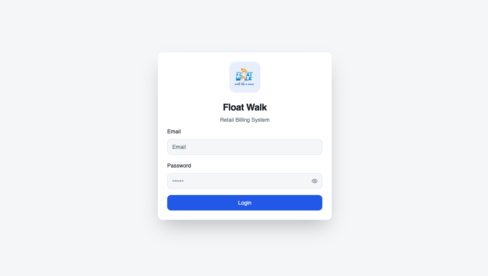

# Float Walk

## App Example



## Technologies Used

This project is built with:

- Vite
- TypeScript
- React
- shadcn-ui
- Tailwind CSS

## Project info

**GitHub Repository**: https://github.com/gpdhanush/float-walk-praveen.git

Follow these steps:

```sh
# Step 1: Clone the repository using the project's Git URL.
git clone https://github.com/gpdhanush/float-walk-praveen.git

# Step 2: Navigate to the project directory.
cd float-walk-praveen

# Step 3: Install the necessary dependencies.
npm i

# Step 4: Start the development server with auto-reloading and an instant preview.
npm run dev
```
